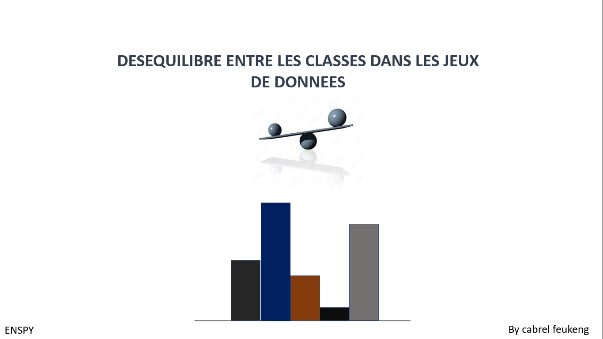
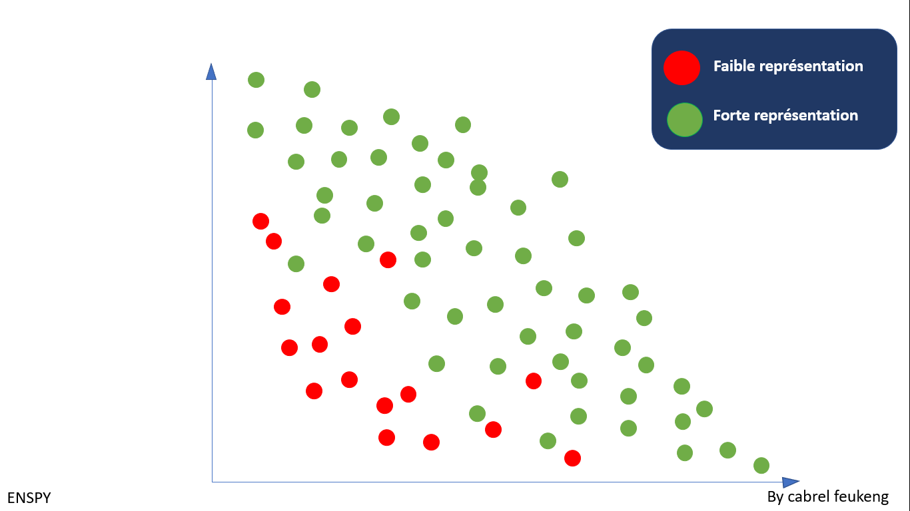
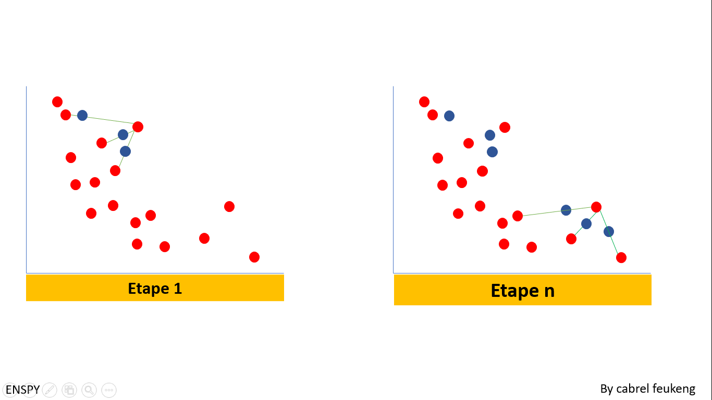

# Imbalance In Data

* Le Déséquilibre entre les classes d'un jeux de données.
- 
- Nous parlons de deséquilibre entre mes classe d'un jeux de données lorsque nous faisons face à au moins classes qui a une forte representation dans le jeux, il s'agit alors d'une classe dite majoritaire; et une autre classe qui n'a qu'une faible representation, on parle alors de classe minoritaire.

* Cas genéral.

# Data Augmentation

- SMOTE (Synthetic Minority Over-sampling TEchnique).
SMOTEest une technique de pretraitement des données utilisée dans la cadre des données non equilibrées suivant differentes classe de donné

\sqrt{x}

\x

x^n

x^2

\|x\_2 = \sqrt{x_1^2 + x_2^2 + \dots + x_n^9}

\|x\|_\infty = \max (|x_1|, |x_2|, \dots , |x_n|)

